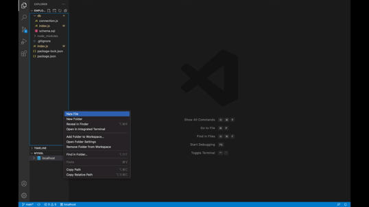

# Employee Tracker MySQL

[](https://opensource.org/licenses/ISC)

## Description
This program allows users to manage, departments, roles and employees inside an organization. Users are able to add/view: departments, roles and employees and update employee roles.


## Table of Contents
* [Installation](#installation)
* [Usage](#usage)
* [License](#license)
* [Tests](#tests)
* [Contributors](#contributors)
* [Questions](#questions)

## Installation
To install run the following command: ```npm i``` in code editor's integrated terminal to make sure that you have package-lock and package.json

## Usage
After installing run node ```index.js``` in your code editor's integrated terminal to access database and add/view and update employee roles.



## License 
    
    This project is licensed under ISC license.

## Tests
To run test run the following command: No test associated

## Contributors
These people helped complete this project: Morgan Splawn (Tutor)

## Questions
For any questions reach out to me via the following methods: 
* Github: [childishmartino](https://github.com/childishmartino)
* Email: [chrisg1821@gmail.com](mailto:chrisg1821@gmail.com)
* LinkedIn: [chris-garcia-30248435](https://www.linkedin.com/in/chris-garcia-30248435/)

